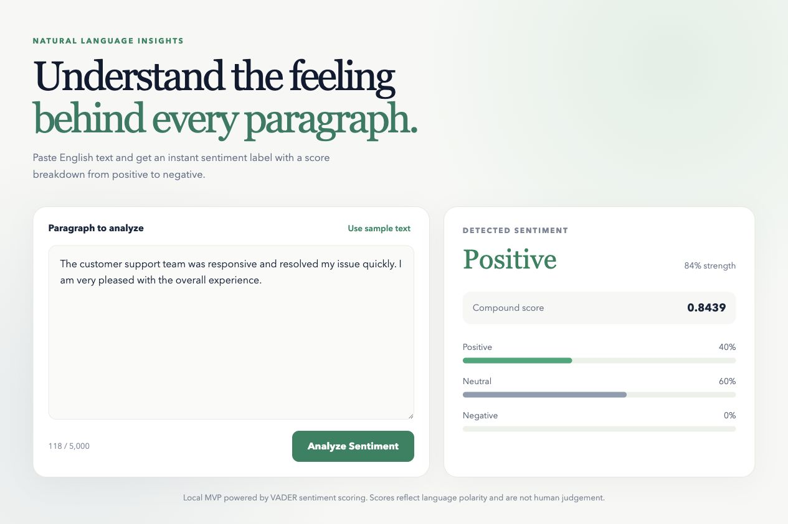

# Sentiment Analyzer

A full-stack web app that analyzes an English paragraph and returns an
overall sentiment plus a numeric score breakdown.



## Project folders

- `frontend/`: React, TypeScript, and Vite single-page user interface
- `backend/`: FastAPI API using the VADER sentiment analyzer

VADER is a lightweight rule-based sentiment model. It is a good local MVP
choice because it starts quickly and returns positive, neutral, negative, and
compound scores without requiring a large model download. A transformer model
can be added later behind the same API contract.

## Run locally

### Backend

```bash
cd backend
python3 -m venv .venv
source .venv/bin/activate
pip install -r requirements.txt -r requirements-dev.txt
uvicorn app.main:app --reload --port 8000
```

The backend is available at `http://localhost:8000`. Interactive API
documentation is at `http://localhost:8000/docs`.

### Frontend

In a second terminal:

```bash
cd frontend
npm install
npm run dev
```

Open `http://localhost:5173`.

## Deploy On Render

The repository includes a `Dockerfile` and `render.yaml` blueprint for a
single free Render web service. During deployment, Docker builds the React
frontend and the FastAPI server serves both the application and API from the
same public URL.

1. In Render, create a new Blueprint from this GitHub repository.
2. Confirm the `sentiment-analizer` free web service.
3. Wait for deployment to complete, then open the generated `onrender.com`
   URL.

Free Render services can spin down while idle, so the first request after a
period of inactivity can be slower.

## API

`POST /api/analyze`

```json
{
  "text": "The onboarding was straightforward and I enjoyed every step."
}
```

Example response:

```json
{
  "text": "The onboarding was straightforward and I enjoyed every step.",
  "sentiment": "positive",
  "compound_score": 0.5719,
  "confidence": 0.5719,
  "scores": {
    "positive": 0.333,
    "neutral": 0.667,
    "negative": 0.0
  }
}
```

The `compound_score` is normalized from `-1` (most negative) to `1` (most
positive). `confidence` is the absolute compound score for an easy strength
indicator in this MVP; it is not a probabilistic model confidence.
